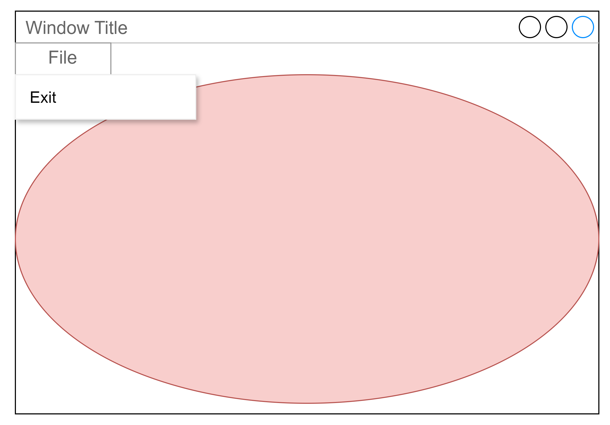
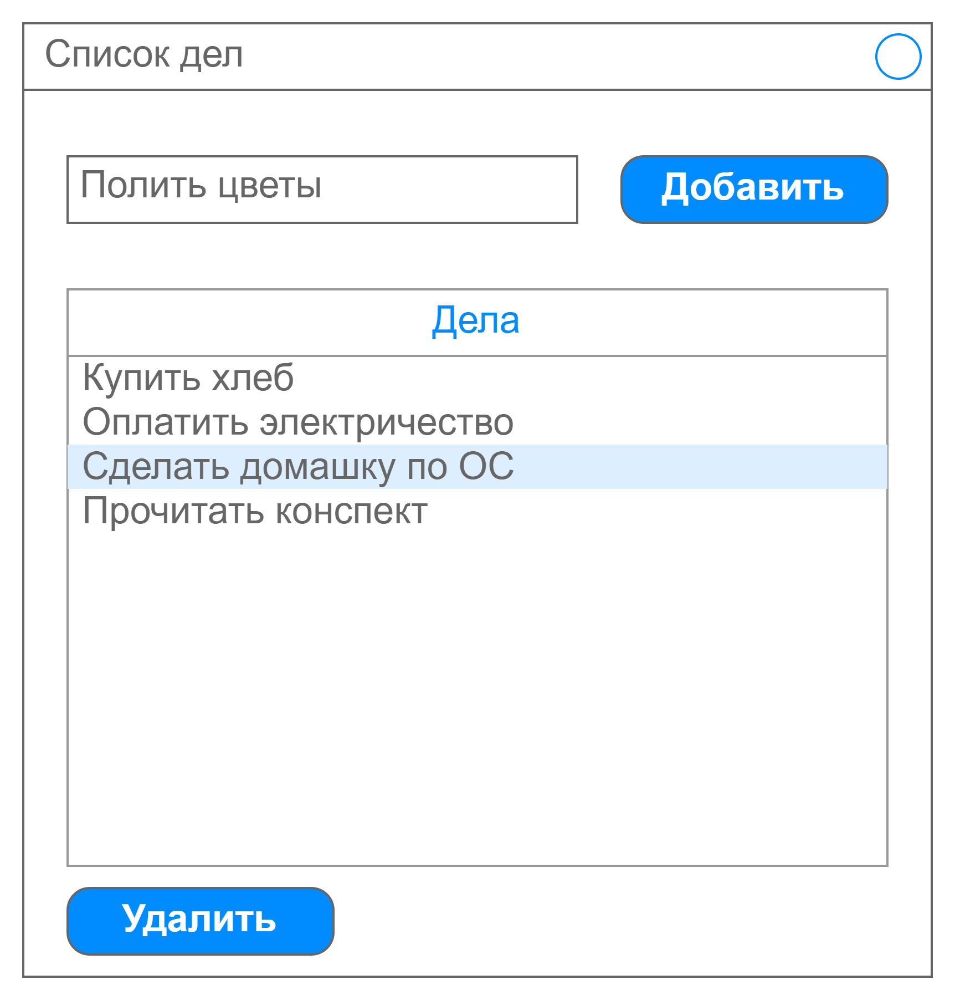

# Лабораторная работа №8

- [Лабораторная работа №8](#лабораторная-работа-8)
  - [Задания](#задания)
    - [Требования](#требования)
    - [Задание 1 — Графическое приложение для Windows — 50 баллов](#задание-1--графическое-приложение-для-windows--50-баллов)
    - [Задание 2 — Графическое приложение для Linux — 100 баллов](#задание-2--графическое-приложение-для-linux--100-баллов)
    - [Задание 3 — Кросс-платформенное графическое приложение — 150 баллов](#задание-3--кросс-платформенное-графическое-приложение--150-баллов)

## Задания

- Для получения оценки "удовлетворительно" нужно набрать не менее 120 баллов.
- Для получения оценки "хорошо" нужно набрать не менее 180 баллов.
- Для получения оценки "отлично" нужно набрать не менее 240 баллов.

### Требования

Обязательно проверяйте успешность всех вызовов функций операционной системы и не оставляйте ошибки незамеченными.

Ваш код должен иметь уровень безопасности исключений не ниже базового.
Для этого разработайте (или возьмите готовую) RAII-обёртку, автоматизирующую
управление ресурсами операционной системы.

### Задание 1 — Графическое приложение для Windows — 50 баллов

Разработайте оконное приложение для ОС Windows, которое создаёт окно с меню,
кнопками сворачивания, разворачивания и закрытия.

Оконное приложение должно быть разработано с использованием функций Windows API.

В меню должен быть пункт File, внутри которого содержится пункт Exit.
При выборе пункта Exit приложение должно завершить свою работу.

В мню также должен быть пункт `Help->About`.
При его выборе должен показаться Message box с информацией об авторе программы.

В клиентскую область окна должен быть вписан эллипс. При изменении размеров окна
эллипс продолжает вписываться во внутреннюю область.
При клике мышью внутри эллипса он должен менять свой цвет на случайный.



### Задание 2 — Графическое приложение для Linux — 100 баллов

Ознакомьтесь с оконным менеджером X11. Напишите приложение для ОС Linux, рисующее падающие снежинки.
Каждая снежинка должна выводиться в виде точки или маленькой окружности.
Подберите параметры анимации таким образом, чтобы эффект выглядел красиво.

Подсказки:

Чтобы установить libX11 под Ubuntu, выполните в консоли команду:

```bash
sudo apt-get install libx11-dev
```

В CMakeLists.txt добавьте строчки:

```txt
find_package(X11 REQUIRED)

if (X11_FOUND)
    include_directories(${X11_INCLUDE_DIR})
    message(STATUS "X11_INCLUDE_DIR: ${X11_INCLUDE_DIR}")
    message(STATUS "X11_LIBRARIES: ${X11_LIBRARIES}")
else ()
    message(FATAL_ERROR "X11 library not found")
endif ()

# Имя_исполняемого_проекта, которое вы добавляли через add_executable:
target_link_libraries(Имя_исполняемого_проекта ${X11_LIBRARIES})
```

### Задание 3 — Кросс-платформенное графическое приложение — 150 баллов

Напишите с помощью одной из кроссплатформенных библиотек (wxWidgets, Qt, GTK)
кроссплатформенное приложение для ведения списка дел.
При сдаче работы продемонстрируйте его работу под Windows и Linux.

В нём пользователь может добавлять задачи в список, введя непустое описание в текстовое поле и нажав кнопку "Добавить".
Кнопка добавления неактивна, если текст пустой.

Неактуальные дела можно выделить в списке и удалить при помощи кнопки "Удалить".



При старте приложение загружает список дел из файла, хранящегося в домашнем каталоге пользователя.
Если файла ещё нет, то приложение стартует с пустым списком дел.
При выходе автоматически сохраняет список дел.
Формат файла выберите на своё усмотрение.

Если приложение уже запущено, то повторный запуск не производится.
Это нужно, чтобы избежать конфликтов при работе с файлом списка дел.
