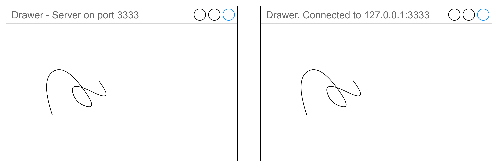

# Лабораторная работа №9

- [Лабораторная работа №9](#лабораторная-работа-9)
  - [Задания](#задания)
    - [Требования](#требования)
    - [Задание 1 — Калькулятор — 50 баллов](#задание-1--калькулятор--50-баллов)
    - [Задание 2 — Доска для рисования — 150 баллов](#задание-2--доска-для-рисования--150-баллов)
      - [Бонус за возможность клиентов также управлять рисованием — 50 баллов](#бонус-за-возможность-клиентов-также-управлять-рисованием--50-баллов)
      - [Бонус за возможность смены цвета рисования — 20 баллов](#бонус-за-возможность-смены-цвета-рисования--20-баллов)
    - [Задание 3 — Будет добавлено позже](#задание-3--будет-добавлено-позже)

## Задания

- Для получения оценки "удовлетворительно" нужно набрать не менее X баллов.
- Для получения оценки "хорошо" нужно набрать не менее Y баллов.
- Для получения оценки "отлично" нужно набрать не менее Z баллов.

### Требования

Обязательно проверяйте успешность всех вызовов функций операционной системы и не оставляйте ошибки незамеченными.

Ваш код должен иметь уровень безопасности исключений не ниже базового.
Для этого разработайте (или возьмите готовую) RAII-обёртку, автоматизирующую
управление ресурсами операционной системы.

### Задание 1 — Калькулятор — 50 баллов

Напишите консольное приложение-калькулятор (либо для Linux, либо для Windows),
способное работать как в режиме клиента, так и в режиме сервера.
Обмен данными между клиентом и сервером должен осуществляться с использованием
функций для работы с сокетами для вашей операционной системы.

В режиме сервера приложение ожидает TCP-подключений к порту `PORT` и
выполняет команды, отправляемый клиентами. Синтаксис командной строки:

```bash
calc PORT
```

Запуск в режиме клиента приложение подключается по TCP-соединению к порту `PORT` сервера с адресом `ADDRESS`.
Синтаксис командной строки.

```bash
calc ADDRESS PORT
```

В режиме клиента пользователь может отправлять на сервер команды двух видов:

- сложение целых чисел.
- вычитание целых чисел.

Числа могут быть положительными, отрицательными или равны нулю.

Синтаксис команды сложения:

```txt
+ число1 число2 ... числоN
```

В ответ на эту команду сервер должен вычислить сумму `число1 + число2 + ... + числоN` и отправить её клиенту.

Синтаксис команды вычитания:

```txt
- число1 число2 ... числоN
```

В ответ на эту команду сервер должен вычислить разность `число1 - число2 - ... - числоN` и отправить её клиенту.
В случае некорректных данных, например, если переданы не целые числа или не передано ни одного числа,
сервер должен вернуть ошибку.

Получив ответ от сервера, клиент должен вывести результат и продолжить ввод.

При отключении клиента сервер должен продолжать работу с остальными клиентами.

### Задание 2 — Доска для рисования — 150 баллов

Ознакомьтесь с библиотекой [Boost.Asio](https://www.boost.org/doc/libs/1_86_0/doc/html/boost_asio.html).
Используйте её для работы с сокетами в этом задании.

Разработайте GUI-приложение, эмулирующее работу доски для рисования.

Приложение может работать как в режиме сервера либо в режиме клиента.
Запуск в режиме сервера:

```bash
whiteboard PORT
```

Запустив приложение в режиме сервера, пользователь может рисовать
на поверхности окна линии при помощи мыши.
При этом приложение должно быть способно принимать подключения
к указанному порту и отправлять клиентам информацию о рисуемых линиях.

Запуск приложения в режиме клиента:

```bash
whiteboard ADDRESS PORT
```

В этом режиме приложение подключается к указанному серверу и отображает
все линии, которые были нарисованы на сервере после момента подключения.

К серверу может динамически подключаться произвольное количество клиентов.
При закрытии приложения-клиента сервер должен продолжать работу
и отправлять команды рисования оставшимся клиентам.


Клиент (справа) повторяет рисунок, который нарисован на сервере (слева).

При изменении размеров окна приложения (не важно, клиентского или серверного), изображение в окне пропадать не должно.
Область изображения можно ограничить некоторыми разумными  размерами (например 800*600 пикселей).

#### Бонус за возможность клиентов также управлять рисованием — 50 баллов

Пользователи, запустившие приложение в режиме клиента также должны быть
способны рисовать в своём окне при помощи мыши.
Другие пользователи, включая пользователя, запустившего сервер, должны
видеть то, что рисует пользователь.

#### Бонус за возможность смены цвета рисования — 20 баллов

Пользователь должен иметь возможность изменить цвет рисования, используя команду меню.
Если в вашей программе клиенты также могут рисовать на доске,
то каждый из них выбирает только цвет только собственного маркера.

Внимание, организуйте такой способ обмена данными между приложениями,
чтобы порядок отрисовки линий в них был одинаковым.

Например, если 3 пользователя начали рисовать линии разного цвета,
все они должны видеть линии в одном и том же порядке.

### Задание 3 — Будет добавлено позже
