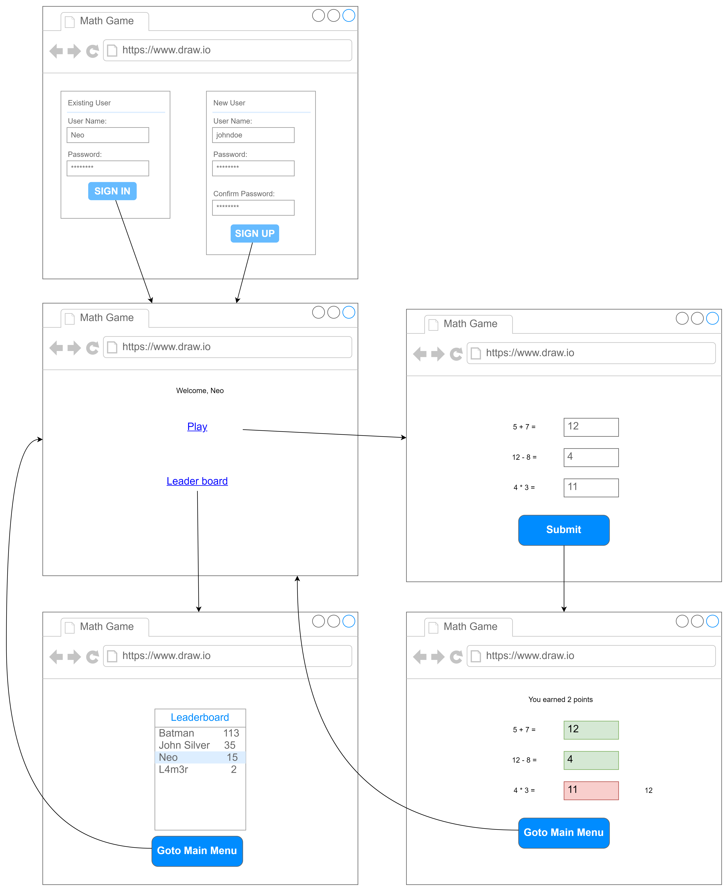
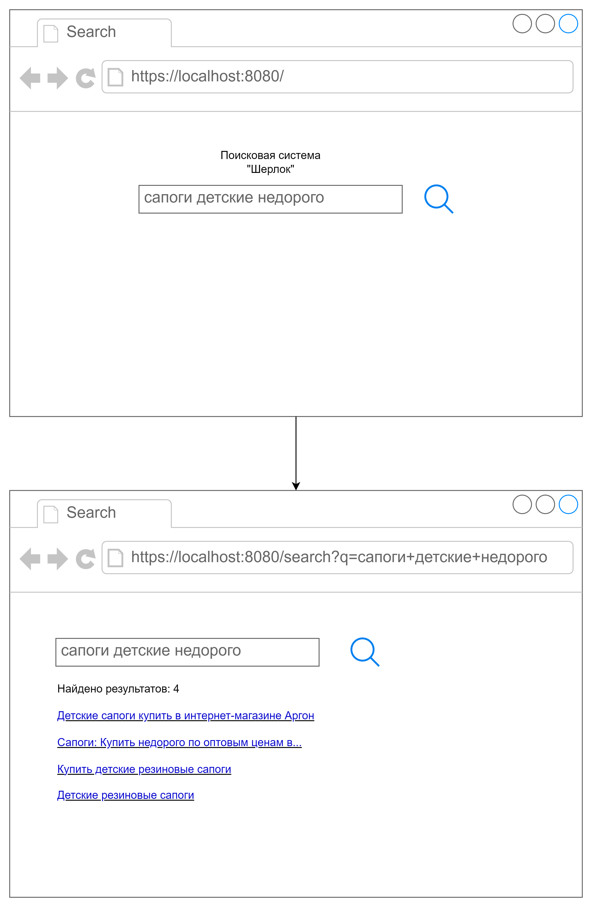
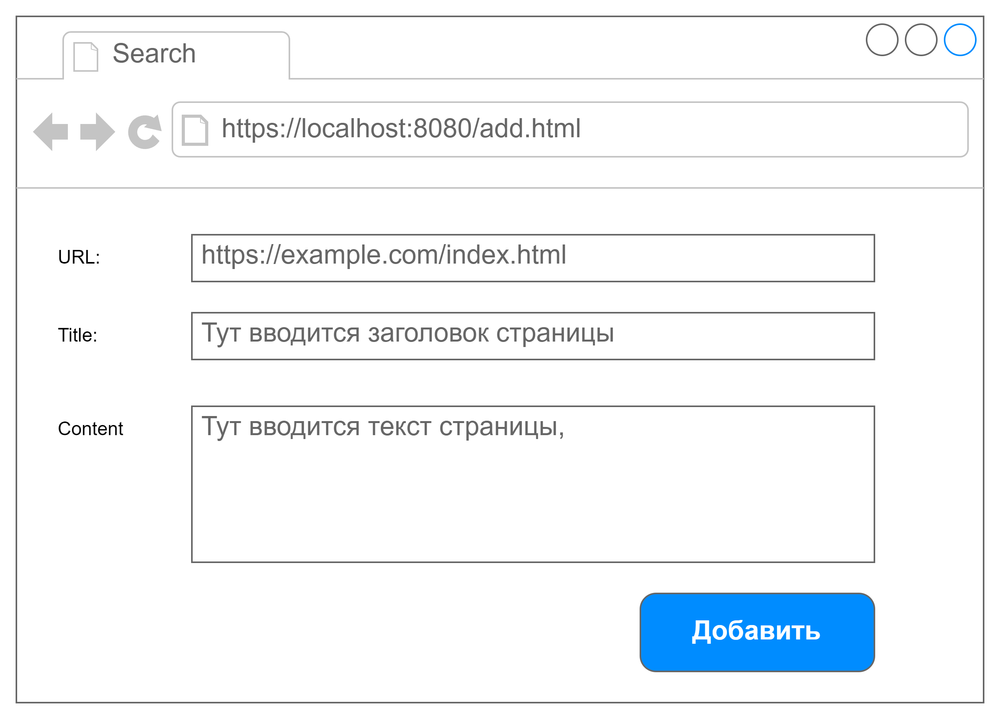

# Лабораторная работа №9

- [Лабораторная работа №9](#лабораторная-работа-9)
  - [Задания](#задания)
    - [Требования](#требования)
    - [Задание 1 — Калькулятор — 50 баллов](#задание-1--калькулятор--50-баллов)
    - [Задание 2 — Доска для рисования — 150 баллов](#задание-2--доска-для-рисования--150-баллов)
      - [Бонус за возможность клиентов также управлять рисованием — 50 баллов](#бонус-за-возможность-клиентов-также-управлять-рисованием--50-баллов)
      - [Бонус за возможность смены цвета рисования — 20 баллов](#бонус-за-возможность-смены-цвета-рисования--20-баллов)
    - [Задание 3](#задание-3)
      - [Вариант 1 — Математическая викторина — 200 баллов](#вариант-1--математическая-викторина--200-баллов)
        - [Бонус за хранение информации о пользователях и их результатах в базе данных — 50 баллов](#бонус-за-хранение-информации-о-пользователях-и-их-результатах-в-базе-данных--50-баллов)
        - [Бонус за возможность выполнить graceful shutdown  — 10 баллов](#бонус-за-возможность-выполнить-graceful-shutdown---10-баллов)
      - [Вариант 2 — Поисковый сервер — 200 баллов](#вариант-2--поисковый-сервер--200-баллов)
        - [Сохранение документов в постоянное хранилище — 50 баллов](#сохранение-документов-в-постоянное-хранилище--50-баллов)
        - [Бонус за автоматическое наполнение поисковой системы —80 баллов](#бонус-за-автоматическое-наполнение-поисковой-системы-80-баллов)
        - [Бонус за поддержку постраничной выдачи результатов — 20 баллов](#бонус-за-поддержку-постраничной-выдачи-результатов--20-баллов)
        - [Бонус за вывод фрагмента документа, содержащего искомые слова — 50 баллов](#бонус-за-вывод-фрагмента-документа-содержащего-искомые-слова--50-баллов)
        - [Бонус за возможность выполнить graceful shutdown  — 10 баллов](#бонус-за-возможность-выполнить-graceful-shutdown---10-баллов-1)

## Задания

- Для получения оценки "удовлетворительно" нужно набрать не менее 120 баллов.
- Для получения оценки "хорошо" нужно набрать не менее 250 баллов.
- Для получения оценки "отлично" нужно набрать не менее 500 баллов.

### Требования

Обязательно проверяйте успешность всех вызовов функций операционной системы и не оставляйте ошибки незамеченными.

Ваш код должен иметь уровень безопасности исключений не ниже базового.
Для этого разработайте (или возьмите готовую) RAII-обёртку, автоматизирующую
управление ресурсами операционной системы.

### Задание 1 — Калькулятор — 50 баллов

Напишите консольное приложение-калькулятор (либо для Linux, либо для Windows),
способное работать как в режиме клиента, так и в режиме сервера.
Обмен данными между клиентом и сервером должен осуществляться с использованием
функций для работы с сокетами для вашей операционной системы.

В режиме сервера приложение ожидает TCP-подключений к порту `PORT` и
выполняет команды, отправляемый клиентами. Синтаксис командной строки:

```bash
calc PORT
```

Запуск в режиме клиента приложение подключается по TCP-соединению к порту `PORT` сервера с адресом `ADDRESS`.
Синтаксис командной строки.

```bash
calc ADDRESS PORT
```

В режиме клиента пользователь может отправлять на сервер команды двух видов:

- сложение целых чисел.
- вычитание целых чисел.

Числа могут быть положительными, отрицательными или равны нулю.

Синтаксис команды сложения:

```txt
+ число1 число2 ... числоN
```

В ответ на эту команду сервер должен вычислить сумму `число1 + число2 + ... + числоN` и отправить её клиенту.

Синтаксис команды вычитания:

```txt
- число1 число2 ... числоN
```

В ответ на эту команду сервер должен вычислить разность `число1 - число2 - ... - числоN` и отправить её клиенту.
В случае некорректных данных, например, если переданы не целые числа или не передано ни одного числа,
сервер должен вернуть ошибку.

Получив ответ от сервера, клиент должен вывести результат и продолжить ввод.

При отключении клиента сервер должен продолжать работу с остальными клиентами.

### Задание 2 — Доска для рисования — 150 баллов

Ознакомьтесь с библиотекой [Boost.Asio](https://www.boost.org/doc/libs/1_86_0/doc/html/boost_asio.html).
Используйте её для работы с сокетами в этом задании.

Разработайте GUI-приложение, эмулирующее работу доски для рисования.

Приложение может работать как в режиме сервера либо в режиме клиента.
Запуск в режиме сервера:

```bash
whiteboard PORT
```

Запустив приложение в режиме сервера, пользователь может рисовать
на поверхности окна линии при помощи мыши.
При этом приложение должно быть способно принимать подключения
к указанному порту и отправлять клиентам информацию о рисуемых линиях.

Запуск приложения в режиме клиента:

```bash
whiteboard ADDRESS PORT
```

В этом режиме приложение подключается к указанному серверу и отображает
все линии, которые были нарисованы на сервере после момента подключения.

К серверу может динамически подключаться произвольное количество клиентов.
При закрытии приложения-клиента сервер должен продолжать работу
и отправлять команды рисования оставшимся клиентам.


*Клиент (справа) повторяет рисунок, который нарисован на сервере (слева).*

При изменении размеров окна приложения (не важно, клиентского или серверного), изображение в окне пропадать не должно.
Область изображения можно ограничить некоторыми разумными  размерами (например 800*600 пикселей).

#### Бонус за возможность клиентов также управлять рисованием — 50 баллов

Пользователи, запустившие приложение в режиме клиента также должны быть
способны рисовать в своём окне при помощи мыши.
Другие пользователи, включая пользователя, запустившего сервер, должны
видеть то, что рисует пользователь.

#### Бонус за возможность смены цвета рисования — 20 баллов

Пользователь должен иметь возможность изменить цвет рисования, используя команду меню.
Если в вашей программе клиенты также могут рисовать на доске,
то каждый из них выбирает только цвет только собственного маркера.

Внимание, организуйте такой способ обмена данными между приложениями,
чтобы порядок отрисовки линий в них был одинаковым.

Например, если 3 пользователя начали рисовать линии разного цвета,
все они должны видеть линии в одном и том же порядке.

### Задание 3

#### Вариант 1 — Математическая викторина — 200 баллов

Разработайте с помощью библиотек Boost.Asio и Boost.Beast реализующий бэкенд для математической викторины.
Фронтенд приложения может быть разработан с использованием произвольных технологий.
Делать SPA или многостраничное приложение — выбирайте сами.


*Экраны математической викторины*

Приложение должно быть многопользовательским.
Если пользователь не залогинен, ему должно быть предложено либо залогиниться, введя логин и пароль,
либо зарегистрироваться под новым пользователем.

Если пользователь залогинен, ему отображается главное меню, на котором ему доступны две опции:

- Поиграть в викторину
- Посмотреть таблицу рекордов

На странице игры пользователю предлагается список,
содержащий от 5 до 10 случайно сгенерированных сервером арифметических примеров.
Пользователь должен ввести ответы на все примеры и нажать кнопку отправки ответов.

Ответы должны быть отправлены на бэкенд и там же проверены на корректность.
В ответ сервер должен прислать информацию о том,
какие примеры были решены правильно, а какие нет. С этой страницы пользователь может вернуться в главное меню.

За правильно решенный пример пользователь получает $+1$ балл.
За неправильно решённый пример или пример без данного ответа — $-1$ балл.
Набранные за игру баллы добавляются к общему количеству баллов, которые получил пользователь.

Если пользователь не отправил ответ на выданный ему набор примеров,
то при следующем заходе на страницу игры ему должны быть выданы те же примеры.

В таблице рекордов отображаются все игроки и набранные ими баллы, отсортированные в порядке убывания баллов.
Если у нескольких игроков одинаковое количество баллов, они должны быть отсортированы по имени.

Базовая версия приложения может хранить информацию в ОЗУ.
При перезапуске сервера вся информация о пользователях, наборах выданных им примеров и набранных баллах может стираться.

##### Бонус за хранение информации о пользователях и их результатах в базе данных — 50 баллов

Чтобы при перезапуске или внезапном падении сервера информация не терялась,
он должен использовать СУБД для хранения данных, например, PostgreSQL, MySQL или иную по вашему выбору.

- Для PostgreSQL можно использовать [libpqxx](https://github.com/jtv/libpqxx)
- Для MySQL можно использовать [MySQL connector](https://dev.mysql.com/downloads/connector/cpp/)

Идентификаторы сессий активных пользователей можно хранить в оперативной памяти.
В этом случае при перезапуске сервера пользователям нужно будет перелогиниться.

Предусмотрите хранение реквизитов доступа к базе данных в переменных окружения.
При первом запуске программа должна создать в БД необходимые таблицы.

##### Бонус за возможность выполнить graceful shutdown  — 10 баллов

Сервер должен нормальным образом завершать свою работу при получении сигналов `SIGTERM` или `SIGINT`.

#### Вариант 2 — Поисковый сервер — 200 баллов

На основе [поисковой системы из 5 лабораторной работы](../05/README.md) разработайте
веб-сервер, позволяющий добавлять в индекс веб-страницы документы и искать по их содержимому.
Бэкенд сервера должен быть разработан на C++ и использовать библиотеку Boost.Asio и Boost.Beast.

Примерный интерфейс представлен ниже. Стек для разработки фронтенда можете использовать любой.
Вы можете организовать приложение как в виде SPA-приложения, которое
отправляет запросы на бэкенд и рендерит результат, так и в виде
многостраниченого приложения, где контент рендерится на сервере.



Пользователь должен иметь возможность ввести свой запрос в текстовое поле.

В ответ на этот запрос выводится страница с результатами поиска.
На ней отображаются названия документов.
При клике по названию выполняется открытие.
Результаты должны быть отсортированы по релевантности:
сначала выводятся документы, которые лучше всего соответствуют запросу пользователя в соответствии с метрикой TF-IDF.

Должна иметься возможность добавить документ в поисковую систему при помощи формы добавления документа.



Если указан URL ранее проиндексированной страницы, то старое содержимое должно замениться новым.

Добавление, поиск и замена документов могут выполняться многими пользователями одновременно.
Предусмотрите подходящие средства синхронизации, чтобы не было состояния гонки.

В базовой части задания допускается хранить проиндексированные документы
только в ОЗУ и после перезапуска сервера начинать с чистого листа.

##### Сохранение документов в постоянное хранилище — 50 баллов

Предусмотрите возможность сохранения проиндексированной базы данных
в персистентное (постоянное) хранилище, чтобы после перезапуска сервера
восстанавливалась информация о ранее проиндексированных документах.

Вы можете использовать для персистентного хранения данных либо файловую систему,
либо базу данных. Вне зависимости от выбранного способа хранения полнотекстовый поиск
должен выполняться средствами вашего приложения.

##### Бонус за автоматическое наполнение поисковой системы —80 баллов

Сервер должен предоставлять API для добавления документа в индекс и проверки наличия документа в индексе (по URL-у).

Разработайте скрипт (на любом языке программирования), который бы
сканировал содержимое веб-страниц, начиная с некоторой стартовой страницы,
извлекал из них заголовок и текст, очищенный от HTML-тегов.
Извлечённый документ должен добавляться в поисковую систему с помощью API.

Также скрипт должен парсить гиперссылки на странице (тег `<A>`), извлекать из них URL
и повторять процесс индексирования страниц на этом же домене.

Добавление веб страниц через API также может выполняться параллельно,например, несколькими одновременно запущенными скриптами.
Используйте необходимые средства, чтобы не было состояния гонки.

##### Бонус за поддержку постраничной выдачи результатов — 20 баллов

Реализуйте постраничную отдачу результатов поиска.
На каждой странице выводится не более 10 ссылок на документы, а внизу —
ссылки на другие страницы с результатами поиска.

Максимум — 10 страниц.

##### Бонус за вывод фрагмента документа, содержащего искомые слова — 50 баллов

Помимо названия документа должен вывестись фрагмент текста документа,
в котором содержатся найденные слова.
Фрагмент должен включать в себя до 3 слов перед и после искомыми словами.
Сами искомые слова должны быть выделены жирным шрифтом.

Всего должно быть выведено фрагмент не длиннее 30 слов.

Например, имеется документ с таким тестом:

> C++ широко используется для разработки программного обеспечения,
являясь одним из самых популярных языков программирования.
Область его применения включает создание операционных систем,
разнообразных прикладных программ, драйверов устройств,
приложений для встраиваемых систем, высокопроизводительных серверов,
а также компьютерных игр.
Существует множество реализаций языка C++, как бесплатных,
так и коммерческих и для различных платформ.
Например, на платформе x86 это GCC, Clang, Visual C++, Intel C++ Compiler,
Embarcadero (Borland) C++ Builder и другие.
C++ оказал огромное влияние на другие языки программирования,
в первую очередь на Java и C#.

В результатах поиска по запросу "С++ для разработки игр" фрагмент
этого документа должен выводиться так:

> **C++** широко используется **для разработки** программного обеспечения,
являясь … драйверов устройств, приложений **для** встраиваемых систем,
высокопроизводительных … а также компьютерных **игр**.
множество реализаций языка **C++**, как бесплатных,

##### Бонус за возможность выполнить graceful shutdown  — 10 баллов

Сервер должен нормальным образом завершать свою работу при получении сигналов `SIGTERM` или `SIGINT`.
